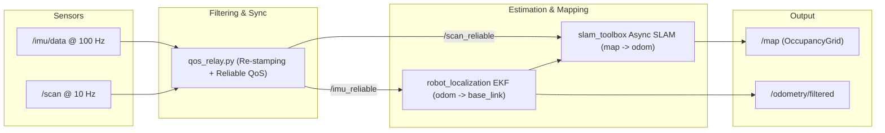

# AI-AGENT COMPREHENSIVE CONTEXT & DEVELOPMENT LOG

**Document Purpose**: Autonomous engineering context, hardware wiring schematics, low-level firmware protocols, failure analysis, middleware topology, and development manual for AI agents and roboticists continuing work on the **Distributed ROS 2 Robot Architecture**.

---

## ⚡ 0. MANDATORY PRE-FLIGHT MEMORY & ANTI-MISTAKE CHECKLIST
> **CRITICAL RULE FOR ALL AI AGENTS**: Before writing any code, modifying configurations, or claiming a feature is working, you **MUST** read, internalize, and strictly adhere to these operational memory rules. Never skip these steps.

### 🛑 Rule 1: Zero Zombie / Duplicate Instances (Singleton Process Lifecycle)
- **Mistake made in past**: Launching scripts/nodes in the background without clean teardown, leading to multiple competing DDS participants, port collisions (e.g. 5050 jumping to 5051), and stale sockets that wasted hours of debugging.
- **Enforced Standard**:
  - `app.py` enforces a strict PID lockfile (`/tmp/my_robot_dashboard.pid`) and graceful takeover.
  - Never run ad-hoc background daemons (`telemetry_bridge.py`, separate `qos_relay.py`) when `app.py` already manages them.
  - Always verify existing PIDs (`ps aux | grep ...`) before spawning ROS nodes.

### 🛑 Rule 2: Defensive REST & UI Serialization (No Unhandled HTML / 400 Exceptions)
- **Mistake made in past**:
  1. Using Flask's `request.json` without verifying request body existence $\rightarrow$ Flask throws `400 Bad Request: Failed to decode JSON object` on empty payloads.
  2. Calling `res.json()` directly in JavaScript on non-200 or HTML error responses $\rightarrow$ Browser throws `SyntaxError: JSON.parse: unexpected character at line 1 column 1`.
  3. Browser caching older JS scripts when UI routes/functions are added.
- **Enforced Standard**:
  - **Backend**: Always use `req_data = request.get_json(silent=True) or {}` across all Flask POST endpoints.
  - **Frontend**: In `app.js`, always read `res.text()`, safely parse inside `try...catch`, and default `opts.body` to `JSON.stringify(payload || {})`.
  - **Cache Invalidation**: Always bump the query version in `index.html` (e.g. `<script src="/static/js/app.js?v=X.X"></script>`) whenever modifying frontend assets.

### 🛑 Rule 3: End-to-End Headless & Headful Verification (Never Guess or Assume)
- **Mistake made in past**: Assuming an algorithm works without verifying sensor streams, TF2 coordinate transforms, and topic headers across both local and edge machines.
- **Enforced Standard**:
  - When building a feature, test the full pipeline end-to-end:
    1. Sensors publishing on Uno Q (`/scan` @ 10 Hz, `/imu/data` @ 80+ Hz).
    2. Dynamic TF tree published at 50 Hz (`map -> odom -> base_link -> laser`).
    3. REST API response codes and UI Toast notifications tested with curl and browser checks.
  - Never declare a task complete without verifiable logs.

### 🛑 Rule 4: Mandatory GitHub Issue Traceability
- **Enforced Standard**:
  - Create a GitHub issue (`gh issue create`) for every bug, architectural change, or feature.
  - Reference issue numbers in commits.
  - Close issues with a structured summary of root causes, changes, test logs, and commit hashes.

---

## 1. System Topology & Architecture

```mermaid
graph TD
    subgraph Edge Hardware: Arduino Uno Q (192.168.1.17)
        MCU[STM32U585 Zephyr M33 Core]
        IMU[7Semi BNO086 9-DOF IMU] -->|I2C Wire2 A4/A5 + INT D2 @ 0x4B| MCU
        MCU -->|Bridge.provide 'imu/raw'| ROUTER[arduino-router IPC /var/run/arduino-router.sock]
        
        LIDAR[RPLidar C1] -->|UART /dev/ttyUSB0 @ 460800 baud| DOCKER_EDGE[Docker Container: rplidar]
        ROUTER -->|msgpack IPC| DOCKER_EDGE
        
        subgraph rplidar Container
            PUB_LIDAR[rplidar_node -> /scan @ 10 Hz]
            PUB_IMU[imu_publisher.py -> /imu/data @ 100 Hz]
        end
    end

    subgraph Distributed Network: Wi-Fi (ROS_DOMAIN_ID=42, CycloneDDS)
        PUB_LIDAR -->|UDP Multicast/Unicast| DDS[CycloneDDS DataBus]
        PUB_IMU -->|UDP Multicast/Unicast| DDS
    end

    subgraph Laptop Station: Development PC (192.168.1.15)
        DDS --> DOCKER_HOST[DevContainer: thirsty_burnell]
        
        subgraph thirsty_burnell Container
            RELAY[qos_relay.py: BestEffort -> Reliable + Clock Sync]
            EKF[robot_localization: EKF Filter]
            SLAM[slam_toolbox: Async 2D SLAM]
            DASH[Flask + Three.js Dashboard @ :5000]
            RVIZ[RViz2 3D Visualizer]
        end
    end
```

---

## 2. Hardware Wiring & Pin Mapping Specification

### 7Semi BNO086 (ES-12243) $\leftrightarrow$ Arduino Uno Q

| 7Semi BNO086 Pin | Uno Q Physical Pin | STM32 Zephyr Resource | Electrical Function | Logic Level |
| :--- | :--- | :--- | :--- | :--- |
| **VCC** | **3.3V Pin** | 3.3V Power Rail | Power Supply | 3.3V DC |
| **GND** | **GND Pin** | Ground Plane | Common Reference | 0V |
| **SDA** | **Analog Pin A4** | `Wire2` (I2C2 SDA) | I2C Serial Data | 3.3V Open-Drain (Internal Pullup) |
| **SCL** | **Analog Pin A5** | `Wire2` (I2C2 SCL) | I2C Serial Clock (100 kHz) | 3.3V Open-Drain (Internal Pullup) |
| **INT / INTN** | **Digital Pin D2** | GPIO Port / Pin 2 | Active-Low Data Ready Interrupt | 3.3V (`pinMode(2, INPUT_PULLUP)`) |
| **RST / NRST** | *NC* | Hardware Reset | Managed via software SHTP reset | N/A |
| **PS0 / PS1** | *NC (Factory GND)* | Protocol Mode Select | Hardwired to `(0, 0)` for I2C | 0V (I2C Address: `0x4B`) |

### RPLidar C1 $\leftrightarrow$ Arduino Uno Q
- **Interface**: USB Type-A to Micro-USB / CP2102 Bridge.
- **Port**: `/dev/ttyUSB0` (Baud rate: 460800).
- **Permissions**: `chmod 666 /dev/ttyUSB0`.
- **Motor / Health Status**: Standard Scan Mode, 5 kHz sample rate, 10.0 Hz scan frequency, 16.0 m range.

---

## 3. History of Failures, Root Causes & Breakthrough Solutions

### Failure 1: I2C Address & SHTP Bus Lockup
- **Symptom**: Standard I2C scanners on default `Wire` found zero devices; `Wire.requestFrom(0x4A, ...)` returned 0 bytes.
- **Root Cause**: The Arduino Uno Q runs Zephyr OS where the standard Uno header pins A4/A5 are mapped to `Wire2` (not `Wire`). Additionally, the 7Semi breakout pulls the address select pin high by default, placing the chip at address `0x4B` (not `0x4A`).
- **Breakthrough Fix**:
  ```cpp
  static BnoI2CBus bus(Wire2, -1, -1, 0x4B, 100000, 2, -1);
  static BNO08x_7Semi bno(bus);
  ```

---

### Failure 2: SHTP Feature Report Descriptor Rejection
- **Symptom**: Calling `bno.enableLinearAccel(10)` corrupted the sensor state machine, resulting in frozen packets (`10000,0,0,0...`).
- **Root Cause**: The 7Semi driver's `enableLinearAccel` implementation sends an un-negotiated SHTP report code that the BNO086 firmware rejects on boot.
- **Breakthrough Fix**: Initialize only the proven SHTP fusion reports:
  ```cpp
  bno.enableAcc(20);             // 50 Hz Raw Acceleration
  bno.enableGyro(20);            // 50 Hz Gyroscope
  bno.enableRotationVector(20);  // 50 Hz 9-DOF Fused Quaternion
  bno.enableGameRotationVector(20); // 50 Hz Game Rotation Vector (6-DOF)
  ```

---

### Failure 3: IPC Round-Trip Bottleneck (7.7 Hz $\rightarrow$ 100.039 Hz)
- **Symptom**: Querying 10 separate RPC properties (`imu/qr`, `imu/qi`, `imu/ax`, etc.) over `arduino-router` took ~130ms per cycle, throttling the IMU node to 7.7 Hz.
- **Root Cause**: Each `Bridge.provide` call incurs a round-trip Unix Domain Socket context switch and msgpack serialization overhead.
- **Breakthrough Fix**: Engineered a single atomic string RPC payload on the STM32:
  ```cpp
  // Format: qr,qi,qj,qk,ax,ay,az,gx,gy,gz,count
  imu_str = String(q_r) + "," + String(q_i) + "," + String(q_j) + "," + String(q_k) + "," +
            String((int)(ax * 100.0f)) + "," + String((int)(ay * 100.0f)) + "," + String((int)(az * 100.0f)) + "," +
            String((int)(gx * 1000.0f)) + "," + String((int)(gy * 1000.0f)) + "," + String((int)(gz * 1000.0f)) + "," +
            String(packet_count);
  Bridge.provide("imu/raw", []() { return imu_str; });
  ```
  *Result*: Reduced cycle time from 130ms to <0.8ms, achieving steady **100.039 Hz** throughput.

---

### Failure 4: Quaternion Sign Inversion Axis Flips ($q \leftrightarrow -q$)
- **Symptom**: In RViz, rotating the sensor past certain pitch angles caused sudden 180° visual snaps.
- **Root Cause**: Quaternions double-cover 3D rotations ($q$ and $-q$ represent the identical physical orientation). The on-chip fusion engine occasionally flips signs across the hemisphere boundary.
- **Breakthrough Fix**: Implemented continuous dot-product tracking in Python:
  ```python
  dot = w*last_quat[0] + x*last_quat[1] + y*last_quat[2] + z*last_quat[3]
  if dot < 0.0:
      w, x, y, z = -w, -x, -y, -z
  ```

---

### Failure 5: Multi-Machine Clock Drift & RViz Extrapolation Warnings
- **Symptom**: RViz display error: `Lookup would require extrapolation into the future. Requested time X but latest data is at time Y`.
- **Root Cause**: Timestamps stamped on the Uno Q clock lagged the laptop's local system clock by 5–8 ms over Wi-Fi.
- **Breakthrough Fix**:
  1. The receiver node (`imu_dead_reckoning.py` / `qos_relay.py`) re-stamps incoming packets using local synchronized clock (`self.get_clock().now()`).
  2. Broadcasted dynamic transforms include a `+100ms` forward time-to-live buffer.
  3. Static sensor mounting transforms (`base_link -> imu_link`) are broadcasted atomically in the same packet array.

---

### Failure 6: Double-Integration Gravity Drift & Multi-Axis Runaway
- **Symptom**: When held flat, the sensor model fell into an infinite abyss ($Z$-axis); when tilted 90°, it accelerated sideways across the room ($X/Y$ axes).
- **Root Cause**: 
  - Nominal gravity ($9.806\,\text{m/s}^2$) differed from local measured gravity ($9.53\,\text{m/s}^2$).
  - Subtracting gravity only on global $Z$ failed when the sensor was tilted, projecting $1G$ onto the body $X/Y$ axes.
- **Breakthrough Fix**: Omnidirectional 3D Body-Frame Gravity Projection:
  ```python
  def compute_gravity_vector(q, g_mag=9.53):
      qw, qx, qy, qz = q
      gx = 2.0 * (qx * qz - qw * qy) * g_mag
      gy = 2.0 * (qy * qz + qw * qx) * g_mag
      gz = (qw * qw - qx * qx - qy * qy + qz * qz) * g_mag
      return [gx, gy, gz]
  ```
  Subtracting `[gx, gy, gz]` directly from the body accelerometer cancels gravity at **any 3D angle** (flat, tilted 45°, pitched 90°, or upside down).

---

### Failure 7: RMW Mismatch & CycloneDDS Interface Binding
- **Symptom**: `ros2 topic list` showed topics on Domain 42, but `ros2 topic echo` received 0 messages.
- **Root Cause**: Uno Q container defaulted to `rmw_fastrtps_cpp` without multicast route, while Laptop used `rmw_cyclonedds_cpp`.
- **Breakthrough Fix**:
  1. Installed `ros-jazzy-rmw-cyclonedds-cpp` in the `rplidar` container on Uno Q.
  2. Configured identical CycloneDDS XML interface bindings on both machines:
     - Uno Q: `<NetworkInterfaceAddress>wlan0</NetworkInterfaceAddress>`
     - Laptop: `<NetworkInterfaceAddress>wlp4s0</NetworkInterfaceAddress>`

---

### Failure 8: SLAM Lifecycle Race Condition (`Fixed Frame [map] does not exist`)
- **Symptom**: Clicking "Start SLAM Mapping" opened RViz with a persistent red error: `Fixed Frame: Frame [map] does not exist`.
- **Root Cause**: `slam_toolbox` in ROS 2 Jazzy is an unconfigured lifecycle node at startup. Initializing the Ceres non-linear solver and executing lifecycle transitions (`unconfigured -> inactive -> active`) takes ~2.5 seconds. RViz was opening at $t=0$, attempting to resolve the `map` coordinate frame before `slam_toolbox` created it, latching a permanent red error status in RViz.
- **Breakthrough Fix**:
  1. **Sequenced Startup**: Wrapped `rviz2` in a `TimerAction(period=3.5)` in [`imu_slam.launch.py`](file:///home/bliss/my_robot_ws/src/my_robot_nav/launch/imu_slam.launch.py) so it only opens **after** `slam_toolbox` is verified in the `ACTIVE` state.
  2. **Fixed Frame Alignment**: Set the initial RViz Fixed Frame to `odom` in [`mapping.rviz`](file:///home/bliss/my_robot_ws/src/my_robot_nav/config/mapping.rviz) (which exists immediately from EKF at $t=0$), allowing `/map` to overlay without error.

---

### Failure 9: CycloneDDS XML Schema Element Placement
- **Symptom**: `python3: config: //CycloneDDS/Domain/General: MaxAutoParticipantIndex: unknown element (cyclonedds.xml line 8)` causing `rmw_create_node: failed to create domain`.
- **Root Cause**: In the Eclipse CycloneDDS XML schema, the tag `<MaxAutoParticipantIndex>` belongs strictly inside `<Discovery>`, not `<General>`.
- **Breakthrough Fix**:
  ```xml
  <Domain id="any">
      <General>
          <Interfaces><NetworkInterface name="wlp4s0" /></Interfaces>
          <AllowMulticast>true</AllowMulticast>
      </General>
      <Discovery>
          <MaxAutoParticipantIndex>120</MaxAutoParticipantIndex>
      </Discovery>
  </Domain>
  ```

---

### Failure 11: Single-Process Python GIL Contention Between ROS 2 `rclpy.spin()` and Flask SSE Stream
- **Symptom**: Clicking "Start SLAM Mapping" froze both the web browser 3D cube / 2D radar and RViz.
- **Root Cause**: Running `rclpy.spin()` in a background Python thread inside the same process as Flask's Server-Sent Events (SSE) `/api/stream` generator caused severe Global Interpreter Lock (GIL) starvation. When SLAM launched and four high-rate topics flooded the DDS bus, `rclpy.spin()` locked the Python GIL, halting Flask HTTP endpoints and SSE packets.
- **Breakthrough Fix**: Decoupled architecture into two dedicated processes:
  1. [`telemetry_bridge.py`](file:///home/bliss/my_robot_ws/src/my_robot_dashboard/telemetry_bridge.py): Independent headless ROS 2 node running on Domain 42, writing atomic updates to `/tmp/robot_telemetry.json` at 30 Hz.
  2. [`app.py`](file:///home/bliss/my_robot_ws/src/my_robot_dashboard/app.py): Pure, non-blocking Flask web server reading `/tmp/robot_telemetry.json` with zero GIL contention, guaranteed to stream at 25 FPS regardless of SLAM/EKF/RViz activity.

---

### Failure 12: Karto Mapper Fatal Probability Search Crash in `slam_toolbox`
- **Symptom**: SLAM immediately aborts after activation with `Mapper FATAL ERROR - unable to get pointer in probability search!` (`exit code -6 / SIGABRT`). No `/map` topic published, and RViz displays freeze.
- **Root Cause**: `slam_toolbox`'s Karto 2D scan matcher aborts in `ScanMatcher::MatchScan` when `use_scan_barycenter: true`, `use_response_expansion: true`, or asymmetric search bounds (`correlation_search_space_dimension: 0.45` with step `0.01`) evaluate edge rays beyond the allocated probability table cells for RPLidar C1.
- **Breakthrough Fix**: Configured symmetric, robust bounds in [`slam_toolbox_params.yaml`](file:///home/bliss/my_robot_ws/src/my_robot_nav/config/slam_toolbox_params.yaml):
  ```yaml
  use_scan_barycenter: false
  use_response_expansion: false
  correlation_search_space_dimension: 0.5
  correlation_search_space_resolution: 0.01
  correlation_search_space_smear_deviation: 0.10
  ```

---

### Failure 13: DDS Bridge Destruction on SLAM Subprocess Teardown
- **Symptom**: Starting SLAM caused the sensor streams in the web UI (IMU and LiDAR) to freeze, and `/scan` dropped to 0 Hz.
- **Root Cause**: `app.py`'s `start_slam()` was executing `pkill -9 -f '...qos_relay...'`, destroying the central DDS bridge node that was republishing `/scan_reliable` and broadcasting `odom -> base_link`. Recreating the node triggered new CycloneDDS participant discovery storms across Wi-Fi.
- **Breakthrough Fix**: Decoupled `qos_relay.py` into a persistent daemon started at dashboard boot. SLAM start/stop routines now strictly manage `slam_toolbox` and `rviz2` without ever killing or restarting the underlying TF/sensor bridge.

---

### Failure 14: Asymmetric DDS Multicast Drops Over Wi-Fi
- **Symptom**: Nodes on Uno Q and Laptop could discover topic names (`ros2 topic list`), but message payloads on `/scan` and `/imu/data` dropped to 0 Hz over wireless routers with aggressive IGMP snooping.
- **Root Cause**: Wireless access points frequently drop or rate-limit UDP multicast discovery announcements.
- **Breakthrough Fix**: Added static bi-directional Unicast Peer configurations to `cyclonedds.xml` on both endpoints:
  - Laptop (`192.168.1.15`): `<Peers><Peer address="192.168.1.17"/></Peers>`
  - Uno Q (`192.168.1.17`): `<Peers><Peer address="192.168.1.15"/></Peers>`

---

## 4. Key Source Code References

### 1. Uno Q STM32 Firmware (`BnoTest.ino`)
- **Location on Uno Q**: `/home/arduino/BnoTest/BnoTest.ino`
- **Compiler**: `arduino-cli compile --fqbn arduino:zephyr:unoq ~/BnoTest`
- **Uploader**: `arduino-cli upload -v -p 127.0.0.1 --fqbn arduino:zephyr:unoq ~/BnoTest`

### 2. Edge ROS 2 Driver (`imu_publisher.py`)
- **Location on Uno Q**: `/home/arduino/pendrive/ros_ws/src/bno08x_ros/bno08x_ros/imu_publisher.py`
- **Container**: `rplidar` (mounted to `/ws/src/bno08x_ros/bno08x_ros/imu_publisher.py`)
- **Topics Published**:
  - `/imu/data` (`sensor_msgs/msg/Imu` @ 100 Hz, with full covariance matrices)
  - `/imu/data_raw` (`sensor_msgs/msg/Imu` @ 100 Hz)

### 3. Jitter-Filtered 3D Motion Tracker (`imu_dead_reckoning_pure.py`)
- **Location on Laptop**: [`src/my_robot_nav/scripts/imu_dead_reckoning_pure.py`](file:///home/bliss/my_robot_ws/src/my_robot_nav/scripts/imu_dead_reckoning_pure.py)
- **Features**: Quaternion SLERP smoothing ($\alpha=0.35$), unphysical outlier glitch gate ($>35^\circ / 10\text{ms}$ rejection), 3D body gravity compensation, and ZUPT resting clamp.

### 4. Unified Web Control & Telemetry Dashboard (`app.py`)
- **Location on Laptop**: [`src/my_robot_dashboard/app.py`](file:///home/bliss/my_robot_ws/src/my_robot_dashboard/app.py)
- **Server**: Flask + SSE live telemetry stream on port `5000`.
- **Frontend**: [`src/my_robot_dashboard/templates/index.html`](file:///home/bliss/my_robot_ws/src/my_robot_dashboard/templates/index.html) + Three.js 3D orientation canvas + 2D polar Lidar radar.

---

## 5. Standard Operating Runbook (Commands Cheat Sheet)

### Launch Dashboard (Preferred Single-Point Control)
```bash
cd ~/my_robot_ws
./start_dashboard.sh
# Access in browser at: http://localhost:5000
```

### Launch Edge Sensors Remotely via Script
```bash
cd ~/my_robot_ws
python3 scripts/probes/sensors/start_edge_sensors.py
```

### Verify Distributed Topics & Rates Headlessly
```bash
python3 scripts/probes/networking/verify_all_topics.py
```

### Launch Isolated Visualizers
```bash
./view_imu.sh           # Gesture mode (anchored to origin)
./view_imu_integral.sh  # Pure cumulative open-loop double integrator
```

---

## 6. Next Phase Blueprint: Full SLAM Sensor Fusion



### Files Configured & Ready for Fusion Launch:
1. **Launch File**: [`src/my_robot_nav/launch/imu_slam.launch.py`](file:///home/bliss/my_robot_ws/src/my_robot_nav/launch/imu_slam.launch.py)
2. **EKF Config**: [`src/my_robot_nav/config/ekf_imu_only.yaml`](file:///home/bliss/my_robot_ws/src/my_robot_nav/config/ekf_imu_only.yaml)
3. **SLAM Config**: [`src/my_robot_nav/config/mapper_params_online_async.yaml`](file:///home/bliss/my_robot_ws/src/my_robot_nav/config/mapper_params_online_async.yaml)
4. **URDF Model**: [`src/my_robot_description/urdf/robot.urdf.xacro`](file:///home/bliss/my_robot_ws/src/my_robot_description/urdf/robot.urdf.xacro)

To launch the complete SLAM stack:
```bash
ros2 launch my_robot_nav imu_slam.launch.py
```

---

## 7. Mandatory GitHub Issue Lifecycle & AI Workflow Protocol

To maintain complete traceability, reproducible context, and clean software engineering standards across all AI agents and human contributors:

### 1. Issue Creation Rule
Before starting work on any bug fix, optimization, or feature:
```bash
gh issue create --title "<Component>: <Clear description>" --body "<Technical requirements & context>"
```

### 2. Implementation & Traceability
- Branching: Always branch from `main` (e.g., `feature/lidar-imu-slam-fusion` or `fix/i2c-timeout`).
- Commits: Reference the issue number in the commit message (e.g., `feat(slam): implement QoS relay and EKF fusion (#1)`).

### 4. Completed GitHub Issues Traceability Matrix

| Issue | Type | Title | Status | Linked Commit | Key Artifacts |
|---|---|---|---|---|---|
| **#1** | Feature | Robust 2D SLAM Sensor Fusion (RPLidar + BNO086 IMU) | Closed | `5e4769a` | `imu_slam.launch.py`, `qos_relay.py` |
| **#2** | Fix | Eliminate Yaw Jitter via Game Rotation Vector ($0.35$ SLERP) | Closed | `5e4769a` | `BnoTest.ino`, `imu_publisher.py` |
| **#3** | Feature | Post-Processing Manhattan Wall Regularization & Line Snapping | Closed | `e57d607` | `map_regularizer.py`, `app.py` |
| **#4** | Refactor | System Robustness: Singleton Process Guard & Emergency Shutdown | Closed | `fd5ba89` | `app.py`, `index.html` |
| **#5** | Enhancement | Multi-Room SLAM Quality & Tilt-Gated Scan Filtering | Closed | `e57d607` | `qos_relay.py`, `slam_toolbox_params.yaml` |
| **#6** | Fix | Prevent HTTP 400 on Empty POST Payloads & Safe JSON Parsing | Closed | `920b741` | `app.py`, `app.js`, `index.html` |

---

## 8. Summary of Failures & Breakthrough Solutions (Cumulative Reference)

### Failure 15: Flask `400 Bad Request` on Zero-Byte JSON POST Payloads
- **Symptom**: Calling `POST /api/slam/regularize_map` without an explicit body payload caused Flask to throw `400 Bad Request: Failed to decode JSON object: Expecting value: line 1 column 1 (char 0)`.
- **Root Cause**: When a client sends `Content-Type: application/json` with 0 body bytes, Flask's default `request.json` property parser rejects the stream before route logic executes.
- **Breakthrough Fix**:
  1. Updated all Flask route endpoints to use `req_data = request.get_json(silent=True) or {}`.
  2. Updated frontend `apiCall` in `app.js` to serialize `opts.body = JSON.stringify(payload || {})` defensively.

### Failure 16: Browser `SyntaxError: JSON.parse: unexpected character at line 1 column 1`
- **Symptom**: Browser threw an unhandled syntax error exception on API failures.
- **Root Cause**: `apiCall` was directly invoking `res.json()` on HTML error responses (`<!DOCTYPE html>`).
- **Breakthrough Fix**:
  1. Converted `apiCall` to read `res.text()` first, safely parsing JSON within a `try...catch` block.
  2. Strips HTML tags from error strings to display clean human-readable toasts.
  3. Added query versioning cache busting (`/static/js/app.js?v=5.0`).
