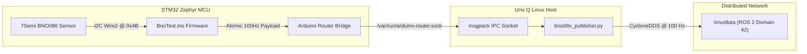
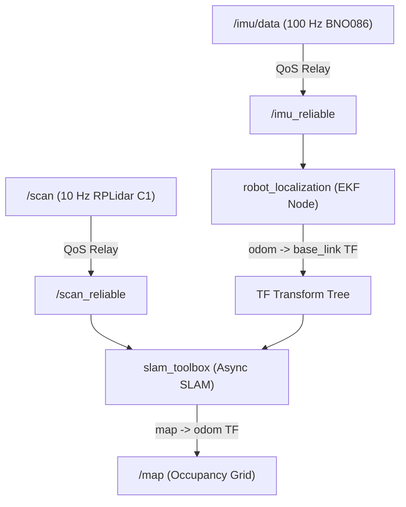

# Edge Sensor Diagnostics, IMU Tracking & SLAM Fusion Architecture Guide

**Author**: Engineering Team  
**Date**: August 2026  
**Target Hardware**: Arduino Uno Q (Qualcomm DragonBoard / STM32U585 Zephyr MCU) + 7Semi BNO086 9-DOF IMU + RPLidar C1  
**Target Software**: ROS 2 Jazzy, CycloneDDS (`ROS_DOMAIN_ID=42`), `robot_localization` (EKF), `slam_toolbox`

---

## Table of Contents
1. [Hardware Wiring & Pin Mapping](#1-hardware-wiring--pin-mapping)
2. [Firmware & IPC Bridge Architecture (100 Hz)](#2-firmware--ipc-bridge-architecture-100-hz)
3. [Distributed Middleware Configuration (CycloneDDS)](#3-distributed-middleware-configuration-cyclonedds)
4. [3D IMU Dead Reckoning & Gravity Mathematics](#4-3d-imu-dead-reckoning--gravity-mathematics)
5. [Step-by-Step Operator Runbook (How to Run Everything)](#5-step-by-step-operator-runbook)
6. [Probing & Diagnostic Tooling Index](#6-probing--diagnostic-tooling-index)
7. [Next Phase: Full Sensor Fusion (RPLidar + IMU + EKF + SLAM)](#7-next-phase-full-sensor-fusion)

---

## 1. Hardware Wiring & Pin Mapping

### 7Semi BNO086 (ES-12243) $\leftrightarrow$ Arduino Uno Q

| 7Semi BNO086 Breakout Pin | Arduino Uno Q Header Pin | Wire Function | Notes |
| :--- | :--- | :--- | :--- |
| **VCC** | **3.3V** | Power (3.3V DC) | Never connect to 5V. |
| **GND** | **GND** | Ground | Common system ground. |
| **SDA** | **Pin A4** (`Wire2`) | I2C Data Line | Controlled by STM32 Zephyr hardware I2C peripheral (`Wire2`). |
| **SCL** | **Pin A5** (`Wire2`) | I2C Clock Line | 100 kHz standard clock speed. |
| **INT / INTN** | **Pin D2** (`GPIO 2`) | Data-Ready Interrupt | Configured with internal `INPUT_PULLUP`. |
| **RST** | *NC / Not Connected* | Hardware Reset | Managed via SHTP soft-reset. |
| **PS0 / PS1** | *NC / Default (0, 0)* | Protocol Selection | Factory tied to GND for I2C communication mode (I2C Address: `0x4B`). |

---

## 2. Firmware & IPC Bridge Architecture (100 Hz)



### Key Engineering Breakthroughs:
1. **Atomic String RPC (`imu/raw`)**:
   Instead of 10 sequential RPC queries (which bottlenecked at 7.7 Hz due to IPC round-trips), the STM32 formats a single comma-delimited string payload:
   $$\text{Payload} = [\text{qr, qi, qj, qk, ax, ay, az, gx, gy, gz, count}]$$
   This unlocked **100.0 Hz throughput** with sub-millisecond latency.

2. **Quaternion Sign-Consistency Inversion Check**:
   Because quaternions double-cover $SO(3)$ ($\mathbf{q} \equiv -\mathbf{q}$), numerical flips during rapid rotation were eliminated using continuous dot-product checks:
   $$\text{if } (\mathbf{q}_k \cdot \mathbf{q}_{k-1} < 0) \implies \mathbf{q}_k \leftarrow -\mathbf{q}_k$$

3. **SHTP Packet Parsing**:
   Restricted report activation to stable BNO086 sensor features (`enableAcc(20)`, `enableGyro(20)`, `enableRotationVector(20)`).

---

## 3. Distributed Middleware Configuration (CycloneDDS)

Both the **Uno Q Robot (`192.168.1.17`)** and the **Laptop Station (`192.168.1.15`)** communicate over **ROS 2 CycloneDDS** on `ROS_DOMAIN_ID=42`.

### Laptop Network XML (`cyclonedds.xml`):
```xml
<?xml version="1.0" encoding="UTF-8" ?>
<CycloneDDS xmlns="https://cdds.io/config">
    <Domain id="any">
        <General>
            <NetworkInterfaceAddress>wlp4s0</NetworkInterfaceAddress>
            <AllowMulticast>true</AllowMulticast>
        </General>
    </Domain>
</CycloneDDS>
```

### Environment Exports (Required on all terminals):
```bash
export ROS_DOMAIN_ID=42
export RMW_IMPLEMENTATION=rmw_cyclonedds_cpp
export CYCLONEDDS_URI=file://${PWD}/cyclonedds.xml
```

---

## 4. 3D IMU Dead Reckoning & Gravity Mathematics

### The Physical Reality of Double Integration:
Accelerometers measure total specific force $\mathbf{a}_{\text{measured}} = \mathbf{a}_{\text{linear}} + \mathbf{g}$.
To estimate position open-loop:
$$\mathbf{v}(t) = \int \mathbf{a}_{\text{linear}}(t) \, dt, \quad \mathbf{p}(t) = \int \mathbf{v}(t) \, dt$$

Because double-integrating any residual bias $\epsilon$ produces quadratic drift ($\frac{1}{2}\epsilon t^2$), we engineered:

1. **Omnidirectional 3D Body-Frame Gravity Projection**:
   Computes the exact gravity vector in the sensor's physical frame at **any tilt angle**:
   $$\begin{aligned}
   g_x &= 2 (x z - w y) \cdot g_{\text{calib}} \\
   g_y &= 2 (y z + w x) \cdot g_{\text{calib}} \\
   g_z &= (w^2 - x^2 - y^2 + z^2) \cdot g_{\text{calib}}
   \end{aligned}$$
   Subtracting $[g_x, g_y, g_z]$ cancels gravity across all axes simultaneously.

2. **Zero-Velocity Update (ZUPT)**:
   Freezes velocity integration whenever angular velocity and linear acceleration fall within resting noise gates.

3. **Quaternion SLERP & Outlier Filtering**:
   Spherical Linear Interpolation eliminates quantization noise and rejects single-frame packet glitches.

---

## 5. Step-by-Step Operator Runbook

### Step 1: Start Edge Sensors on Uno Q (From Laptop)
```bash
cd ~/my_robot_ws
python3 scripts/probes/sensors/start_edge_sensors.py
```
*Expected Output: RPLidar C1 spinning at 10 Hz, BNO086 streaming at 100 Hz.*

---

### Step 2: Verify Topics & Rates Headlessly (From Laptop)
```bash
python3 scripts/probes/networking/verify_all_topics.py
```
*Expected Output: `/scan` @ 10.0 Hz, `/imu/data` @ 100.0 Hz, active quaternion payloads.*

---

### Step 3: Run Isolated Visualizers

#### Mode 1: Gesture Visualizer (With Smooth Origin Anchor)
```bash
./view_imu.sh
```
*Best for: Testing real-time 3D orientation and hand gestures without accumulating runaway wander.*

#### Mode 2: Pure Cumulative Integrator (Open-Loop Trajectory)
```bash
./view_imu_integral.sh
```
*Best for: Inspecting pure open-loop double integration without origin snapping.*

---

## 6. Probing & Diagnostic Tooling Index

| Script | Purpose / Layer |
| :--- | :--- |
| `scripts/probes/sensors/start_edge_sensors.py` | Remotely launches RPLidar C1 and BNO086 on Uno Q via CycloneDDS. |
| `scripts/probes/networking/verify_all_topics.py` | Measures Hz rates, verifies discovery, and checks sample payloads. |
| `scripts/probes/edge_mcu/query_raw_bridge.py` | Queries `/var/run/arduino-router.sock` directly over msgpack IPC. |
| `scripts/probes/edge_mcu/flash_firmware.py` | Recompiles and uploads `BnoTest.ino` to STM32. |
| `view_imu.sh` | Launches gesture-anchored 3D motion tracker and RViz. |
| `view_imu_integral.sh` | Launches pure cumulative open-loop double integrator and RViz. |

---

## 7. Next Phase: Full Sensor Fusion (RPLidar + IMU + EKF + SLAM)



### Launching the Full Fusion Stack:
```bash
ros2 launch my_robot_nav imu_slam.launch.py
```
- **High-Rate Local Smoothness**: Provided by the 100 Hz BNO086 IMU.
- **Global Drift Elimination**: Provided by the 10 Hz RPLidar scan matcher.
- **Drift-Free Pose**: Published on `/odometry/filtered` and `/map`.
