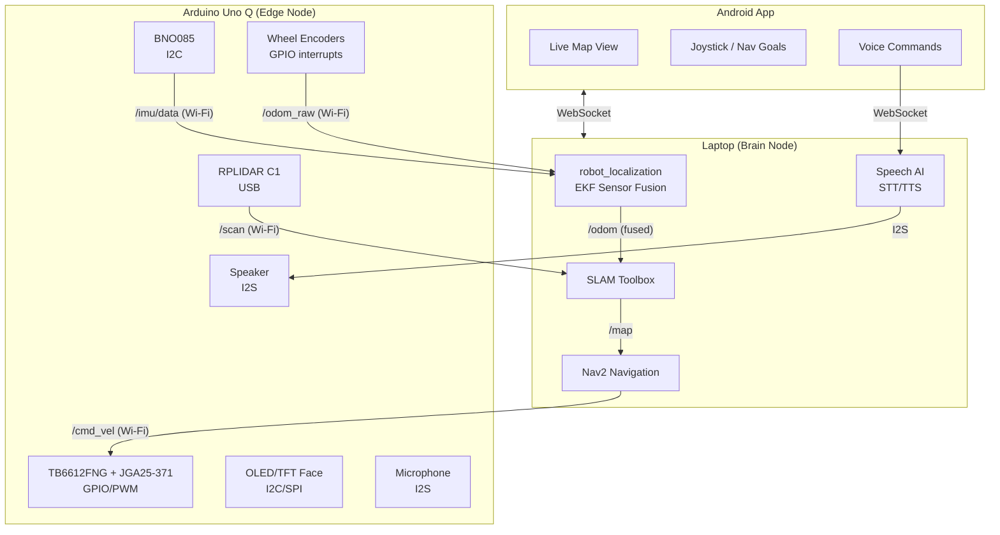

# 🤖 Complete Robot Build Plan & Shopping List

## Current Setup (Done ✅)
- Arduino Uno Q (edge compute, 2GB RAM, ARM64)
- RPLIDAR C1 (2D Lidar, 10Hz, 16m range)
- Laptop (brain node, SLAM, Nav2)
- Power bank (for Uno Q)

---

## 📦 Complete Shopping List

### Phase 3: Drive & Sensor Fusion
| # | Component | Recommended Part | Purpose | Approx Price (₹) |
|---|-----------|-----------------|---------|-------------------|
| 1 | **IMU** | BNO085 breakout (Adafruit/SparkFun) | Rotation + acceleration tracking | 800-1200 |
| 2 | **Gear Motors (x2)** | JGA25-371 with built-in encoders (6V/12V) | Drive wheels | 500-800 (pair) |
| 3 | **Motor Driver** | TB6612FNG dual driver | Efficient MOSFET-based motor control | 150-250 |
| 4 | **Robot Chassis** | 2WD round chassis kit + caster wheel | Physical frame | 300-500 |
| 5 | **Motor Battery** | 7.4V 2S LiPo (1500-2500mAh) | Powers motors separately (prevents Uno Q resets) | 500-800 |
| 6 | **Buck Converter** | LM2596 step-down (7.4V → 5V) | Power Uno Q from the motor battery (eliminate power bank) | 50-100 |
| 7 | **Wires/Connectors** | Dupont jumpers, JST connectors, breadboard | Wiring | 100-200 |

**Phase 3 Total: ~₹2,400 - ₹3,850**

### Phase 5: Android App Control
| # | Component | Purpose | Price |
|---|-----------|---------|-------|
| — | No new hardware | Software only (WebSocket bridge on laptop) | ₹0 |

### Phase 6: Robot Personality (Last Step)
| # | Component | Recommended Part | Purpose | Approx Price (₹) |
|---|-----------|-----------------|---------|-------------------|
| 8 | **Display** | 1.3" OLED SSD1306 (I2C) or 2.4" ILI9341 TFT (SPI) | Robot face expressions | 200-400 |
| 9 | **Speaker** | MAX98357A I2S amp + 3W speaker | Robot voice output | 250-400 |
| 10 | **Microphone** | INMP441 I2S mic | Voice input to robot | 150-250 |

**Phase 6 Total: ~₹600 - ₹1,050**

> [!TIP]
> **Grand Total: ~₹3,000 - ₹5,000** for the complete robot (excluding what you already have)

---

## 🏗️ Architecture Overview



---

## 🗓️ Phased Execution Plan

### Phase 3: Drive & Sensor Fusion
**Goal:** Robot moves on its own with accurate position tracking

| Step | Task | Software |
|------|------|----------|
| 3.1 | Wire BNO085 to Uno Q I2C, publish `/imu/data` | ROS 2 IMU driver node |
| 3.2 | Wire motors + encoders + TB6612FNG to Uno Q | ROS 2 diff_drive controller node |
| 3.3 | Run `robot_localization` EKF on laptop | Fuse IMU + encoders → `/odom` |
| 3.4 | Feed fused `/odom` to SLAM Toolbox | Much cleaner maps! |

### Phase 4: Autonomous Navigation
**Goal:** Click a point on the map → robot drives there

| Step | Task | Software |
|------|------|----------|
| 4.1 | Configure Nav2 stack on laptop | Costmaps, planners, controller |
| 4.2 | Load saved map via map_server | Use the maps we've already saved |
| 4.3 | Send nav goals from RViz | Click "Nav2 Goal" → robot drives there |

### Phase 5: Android App
**Goal:** Control the robot from your phone

| Step | Task | Software |
|------|------|----------|
| 5.1 | Build a ROS2-WebSocket bridge on laptop | `rosbridge_server` package |
| 5.2 | Android app: live map display | Subscribe to `/map` via WebSocket |
| 5.3 | Android app: joystick control | Publish `/cmd_vel` via WebSocket |
| 5.4 | Android app: tap-to-navigate | Send Nav2 goals via WebSocket |

### Phase 6: Personality
**Goal:** Robot has a face, can hear and speak

| Step | Task | Software |
|------|------|----------|
| 6.1 | Wire OLED/TFT to Uno Q, display face animations | Simple bitmap renderer |
| 6.2 | Wire speaker + mic | I2S audio on Uno Q or USB on laptop |
| 6.3 | STT (Speech-to-Text) on laptop | Whisper / Google STT |
| 6.4 | TTS (Text-to-Speech) on laptop | Piper TTS / Google TTS |
| 6.5 | LLM integration for conversation | Local LLM or API-based |

---

## 🔌 Wiring Quick Reference (Phase 3)

```
Arduino Uno Q Pin Connections:
├── USB-C ──→ RPLIDAR C1 (via hub)
├── I2C (SDA/SCL) ──→ BNO085 IMU
├── GPIO (PWM x2) ──→ TB6612FNG (motor speed)
├── GPIO (DIR x2) ──→ TB6612FNG (motor direction)  
├── GPIO (INT x2) ──→ Encoder A/B channels (left motor)
├── GPIO (INT x2) ──→ Encoder A/B channels (right motor)
└── Power
    ├── 7.4V LiPo ──→ TB6612FNG VM (motor power)
    ├── 7.4V LiPo ──→ LM2596 ──→ 5V ──→ Uno Q power
    └── TB6612FNG VCC ──→ 3.3V/5V logic
```

> [!IMPORTANT]
> **Always use a separate battery for motors.** If motors draw too much current from the same source as the Uno Q, voltage drops will reboot the board mid-operation.
